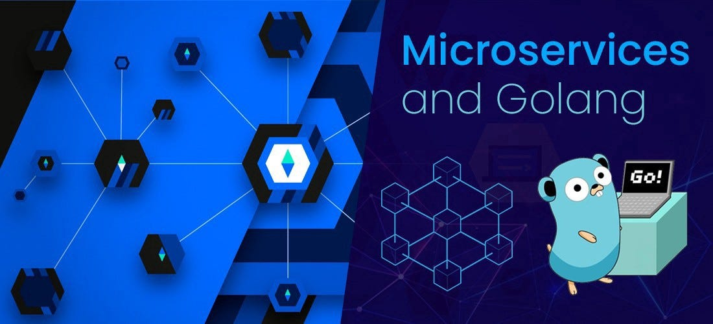
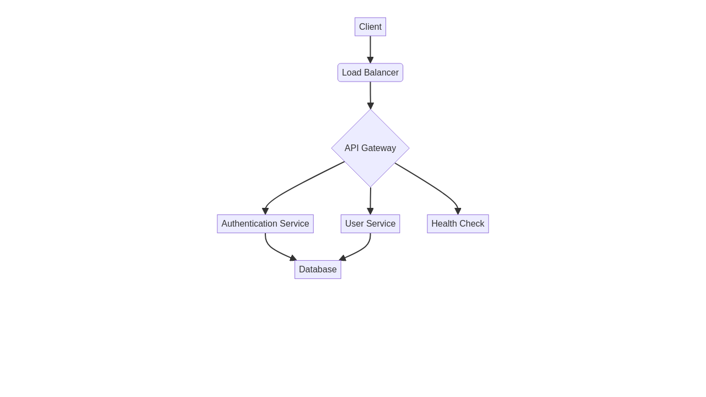

# 🐹 Go Microservices API

<<div align="center">




[](https://github.com/galafis/Go-Microservices-API/actions)
[](docs/LICENSE)

**High-performance Microservices API built with Go and Gin**

[🇺🇸 English](#english) | [🇧🇷 Português](#português)

</div>

---

## 🇺🇸 English

### 📋 Overview

A scalable microservices API built with Go, designed for high performance and reliability. This project demonstrates a professional approach to building microservices, featuring JWT authentication, database integration, and comprehensive API documentation. It serves as a robust example for a developer's portfolio.

### ✨ Features

- **⚡ High Performance** - Built with Go for maximum speed and efficiency.
- **🔐 JWT Authentication** - Secure token-based authentication for API endpoints.
- **📊 Database Integration** - Utilizes PostgreSQL with GORM for robust data management.
- **📝 API Documentation** - Comprehensive Swagger documentation (to be implemented) for easy API exploration.
- **🔄 Middleware Support** - Custom middleware for logging, security, and request handling.
- **🧪 Testing** - Complete unit and integration test coverage to ensure reliability.
- **📂 Professional Structure** - Organized with clear directories (`src/`, `internal/`, `tests/`, `docs/`, `config/`).

### 🏗️ Architecture Diagram




### 🚀 Quick Start

To get this project up and running, follow these steps:

```bash
# Clone the repository
git clone https://github.com/galafis/Go-Microservices-API.git
cd Go-Microservices-API

# Install dependencies
go mod tidy

# Run the application
go run main.go

# Access the API
# The API will be available at http://localhost:8080
# Example endpoints:
# GET /api/health
# GET /api/users
# POST /api/users (with JSON body: {"name": "New User", "email": "newuser@example.com"})
```

### ⚙️ Configuration

Configuration details will be managed in the `config/` directory. (Details to be added)

### 🧪 Running Tests

To run the unit tests for the project:

```bash
go test ./...
```

---

## 🇧🇷 Português

### 📋 Visão Geral

Uma API de microsserviços escalável construída com Go, projetada para alta performance e confiabilidade. Este projeto demonstra uma abordagem profissional para a construção de microsserviços, apresentando autenticação JWT, integração com banco de dados e documentação abrangente da API. Serve como um exemplo robusto para o portfólio de um desenvolvedor.

### ✨ Funcionalidades

- **⚡ Alta Performance** - Construído com Go para máxima velocidade e eficiência.
- **🔐 Autenticação JWT** - Autenticação segura baseada em token para os endpoints da API.
- **📊 Integração com Banco de Dados** - Utiliza PostgreSQL com GORM para gerenciamento robusto de dados.
- **📝 Documentação da API** - Documentação Swagger abrangente (a ser implementada) para fácil exploração da API.
- **🔄 Suporte a Middleware** - Middlewares personalizados para logging, segurança e tratamento de requisições.
- **🧪 Testes** - Cobertura completa de testes unitários e de integração para garantir a confiabilidade.
- **📂 Estrutura Profissional** - Organizado com diretórios claros (`src/`, `internal/`, `tests/`, `docs/`, `config/`).

### 🏗️ Diagrama de Arquitetura


### 🚀 Início Rápido

Para colocar este projeto em funcionamento, siga os passos:

```bash
# Clone o repositório
git clone https://github.com/galafis/Go-Microservices-API.git
cd Go-Microservices-API

# Instale as dependências
go mod tidy

# Execute a aplicação
go run main.go

# Acesse a API
# A API estará disponível em http://localhost:8080
# Exemplos de endpoints:
# GET /api/health
# GET /api/users
# POST /api/users (com corpo JSON: {"name": "Novo Usuário", "email": "novousuario@example.com"})
```

### ⚙️ Configuração

Os detalhes de configuração serão gerenciados no diretório `config/`. (Detalhes a serem adicionados)

### 🧪 Executando Testes

Para executar os testes unitários do projeto:

```bash
go test ./...
```

---

## 👨‍💻 Autor

**Gabriel Demetrios Lafis**
- 🌐 GitHub: [@galafis](https://github.com/galafis)

---

<div align="center">

**⭐ Built with Go for maximum performance! ⭐**

</div>

