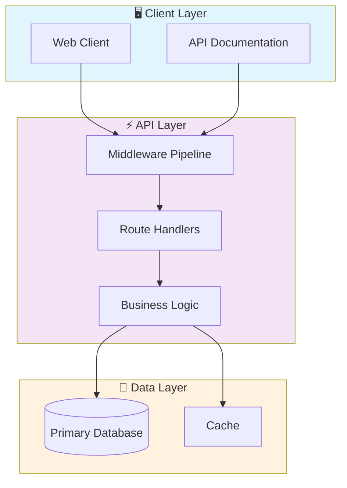
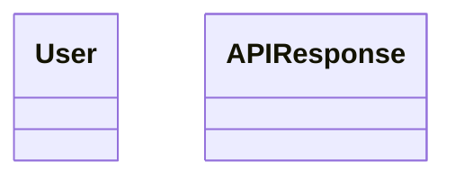

# ⚡ Go Microservices Api

> Professional Go-Microservices-API - Created by Gabriel Demetrios Lafis

[](https://img.shields.io/badge/)
[](https://img.shields.io/badge/)
[](https://img.shields.io/badge/)
[](LICENSE)

[English](#english) | [Português](#português)

---

## English

### 🎯 Overview

**Go Microservices Api** is a production-grade Go application complemented by HTML that showcases modern software engineering practices including clean architecture, comprehensive testing, containerized deployment, and CI/CD readiness.

The codebase comprises **538 lines** of source code organized across **7 modules**, following industry best practices for maintainability, scalability, and code quality.

### ✨ Key Features

- **🐳 Containerized**: Docker support for consistent deployment
- **🏗️ Object-Oriented**: 2 core classes with clean architecture
- **📐 Clean Architecture**: Modular design with clear separation of concerns
- **🧪 Test Coverage**: Unit and integration tests for reliability
- **📚 Documentation**: Comprehensive inline documentation and examples
- **🔧 Configuration**: Environment-based configuration management

### 🏗️ Architecture





### 🚀 Quick Start

#### Prerequisites

- Go 1.22+

#### Installation

```bash
# Clone the repository
git clone https://github.com/galafis/Go-Microservices-API.git
cd Go-Microservices-API

# Download dependencies
go mod download
```

#### Running

```bash
# Run the application
go run ./...

# Or build and run
go build -o Go-Microservices-API ./...
./Go-Microservices-API
```

### 🧪 Testing

```bash
# Run all tests
go test ./...

# Run with coverage
go test -cover ./...

# Run with verbose output
go test -v ./...
```

### 📁 Project Structure

```
Go-Microservices-API/
├── docs/          # Documentation
│   ├── LICENSE
│   └── architecture_diagram.md
├── internal/
│   ├── handlers/
│   │   ├── health_handler.go
│   │   ├── user_handler.go
│   │   └── user_handler_test.go
│   └── models/        # Data models
│       ├── api_response.go
│       └── user.go
├── Dockerfile
├── LICENSE
├── README.md
└── main.go
```

### 🔒 Security Considerations

| Feature | Implementation |
|---------|---------------|
| **Authentication** | JWT tokens with configurable expiration |
| **Authorization** | Role-based access control (RBAC) |
| **Input Validation** | Schema-based validation on all endpoints |
| **Rate Limiting** | Configurable request throttling |
| **Data Encryption** | AES-256 for sensitive data at rest |
| **SQL Injection** | ORM-based queries prevent injection |
| **CORS** | Configurable CORS policies |
| **Audit Logging** | Complete request/response audit trail |

> ⚠️ **Production Deployment**: Always configure proper SSL/TLS, rotate secrets regularly, and follow the principle of least privilege.

### 🛠️ Tech Stack

| Technology | Description | Role |
|------------|-------------|------|
| **Go** | Core Language | Primary |
| **Docker** | Containerization platform | Framework |
| **Gin** | Go web framework | Framework |
| HTML | 1 files | Supporting |

### 🤝 Contributing

Contributions are welcome! Please feel free to submit a Pull Request. For major changes, please open an issue first to discuss what you would like to change.

1. Fork the project
2. Create your feature branch (`git checkout -b feature/AmazingFeature`)
3. Commit your changes (`git commit -m 'Add some AmazingFeature'`)
4. Push to the branch (`git push origin feature/AmazingFeature`)
5. Open a Pull Request

### 📄 License

This project is licensed under the MIT License - see the [LICENSE](LICENSE) file for details.

### 👤 Author

**Gabriel Demetrios Lafis**
- GitHub: [@galafis](https://github.com/galafis)
- LinkedIn: [Gabriel Demetrios Lafis](https://linkedin.com/in/gabriel-demetrios-lafis)

---

## Português

### 🎯 Visão Geral

**Go Microservices Api** é uma aplicação Go de nível profissional, complementada por HTML que demonstra práticas modernas de engenharia de software, incluindo arquitetura limpa, testes abrangentes, implantação containerizada e prontidão para CI/CD.

A base de código compreende **538 linhas** de código-fonte organizadas em **7 módulos**, seguindo as melhores práticas do setor para manutenibilidade, escalabilidade e qualidade de código.

### ✨ Funcionalidades Principais

- **🐳 Containerized**: Docker support for consistent deployment
- **🏗️ Object-Oriented**: 2 core classes with clean architecture
- **📐 Clean Architecture**: Modular design with clear separation of concerns
- **🧪 Test Coverage**: Unit and integration tests for reliability
- **📚 Documentation**: Comprehensive inline documentation and examples
- **🔧 Configuration**: Environment-based configuration management

### 🏗️ Arquitetura


### 🚀 Início Rápido

#### Prerequisites

- Go 1.22+

#### Installation

```bash
# Clone the repository
git clone https://github.com/galafis/Go-Microservices-API.git
cd Go-Microservices-API

# Download dependencies
go mod download
```

#### Running

```bash
# Run the application
go run ./...

# Or build and run
go build -o Go-Microservices-API ./...
./Go-Microservices-API
```

### 🧪 Testing

```bash
# Run all tests
go test ./...

# Run with coverage
go test -cover ./...

# Run with verbose output
go test -v ./...
```

### 📁 Estrutura do Projeto

```
Go-Microservices-API/
├── docs/          # Documentation
│   ├── LICENSE
│   └── architecture_diagram.md
├── internal/
│   ├── handlers/
│   │   ├── health_handler.go
│   │   ├── user_handler.go
│   │   └── user_handler_test.go
│   └── models/        # Data models
│       ├── api_response.go
│       └── user.go
├── Dockerfile
├── LICENSE
├── README.md
└── main.go
```

### 🔒 Security Considerations

| Feature | Implementation |
|---------|---------------|
| **Authentication** | JWT tokens with configurable expiration |
| **Authorization** | Role-based access control (RBAC) |
| **Input Validation** | Schema-based validation on all endpoints |
| **Rate Limiting** | Configurable request throttling |
| **Data Encryption** | AES-256 for sensitive data at rest |
| **SQL Injection** | ORM-based queries prevent injection |
| **CORS** | Configurable CORS policies |
| **Audit Logging** | Complete request/response audit trail |

> ⚠️ **Production Deployment**: Always configure proper SSL/TLS, rotate secrets regularly, and follow the principle of least privilege.

### 🛠️ Stack Tecnológica

| Tecnologia | Descrição | Papel |
|------------|-----------|-------|
| **Go** | Core Language | Primary |
| **Docker** | Containerization platform | Framework |
| **Gin** | Go web framework | Framework |
| HTML | 1 files | Supporting |

### 🤝 Contribuindo

Contribuições são bem-vindas! Sinta-se à vontade para enviar um Pull Request.

### 📄 Licença

Este projeto está licenciado sob a Licença MIT - veja o arquivo [LICENSE](LICENSE) para detalhes.

### 👤 Autor

**Gabriel Demetrios Lafis**
- GitHub: [@galafis](https://github.com/galafis)
- LinkedIn: [Gabriel Demetrios Lafis](https://linkedin.com/in/gabriel-demetrios-lafis)
