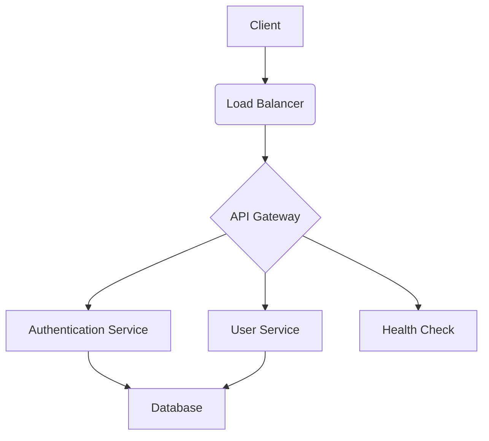

```mermaid
graph TD
    A[Client] --> B(Load Balancer)
    B --> C{API Gateway}
    C --> D[Authentication Service]
    C --> E[User Service]
    C --> F[Health Check]
    D --> G[Database]
    E --> G
```
